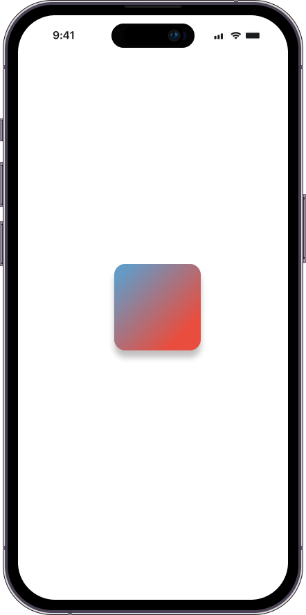

# Gradient and Shadow Project

This project demonstrates a simple, visually appealing UI component with a **gradient background** and **shadow effect** for an iOS or other Swift-based application.

### Overview

The main objective of this project is to create a square view with the following properties:

1. **Rounded Corners** - The view has smoothly rounded corners.
2. **Gradient Background** - The background color of the view transitions with a gradient effect.
3. **Shadow Effect** - A shadow is applied to the view for a subtle, three-dimensional look.
4. **Centered Layout** - The view is centered vertically on the screen and positioned 100pt from the left edge.

### Layout Details

The view is:

- Square-shaped and has a fixed position relative to the screen.
- Always centered vertically.
- Positioned 100pt from the left edge for a consistent layout across devices.
